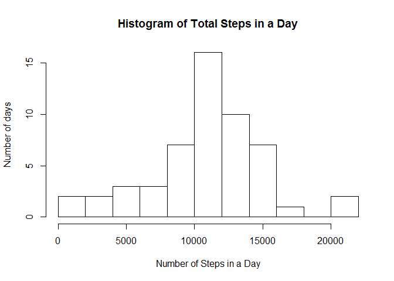
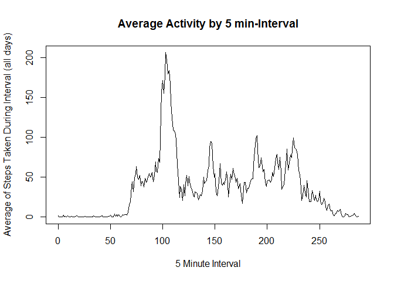
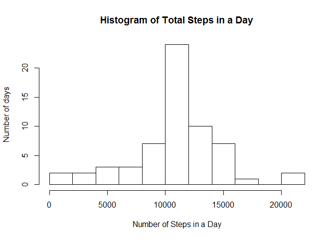
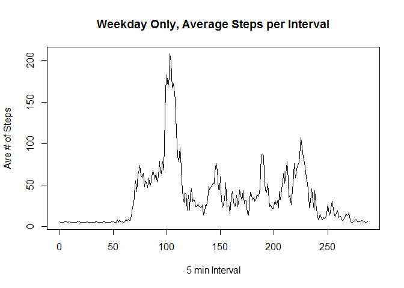
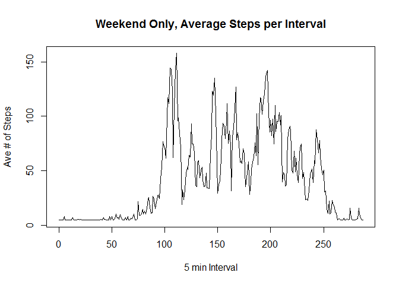

# Reproducible Research: Peer Assessment 1

##Loading and Preprocessing the Data
First step is to clear objects from env, set our working directory, and read in the data


```r
rm(list = ls())
setwd("C:/Users/Kevin/Documents/R/Coursera Files/Reprod_Research")
raw_data <- read.csv("./Project 1 Data/activity.csv")
```

Let's process the data (create a new DF and clean up the "date" column's datatype)


```r
data1 <- raw_data
data1[,2] <- as.Date(data1[,2])
```


##What is the mean total number of steps taken per day?

Now let's sum the steps taken each day, then plot as a histogram

```r
SumAgg <- aggregate(data1[,1], by = list(data1[,2]), FUN = sum)
hist(SumAgg[,2], breaks = 10, xlab = "Number of Steps in a Day", ylab = "Number of days", main = "Histogram of Total Steps in a Day")
```

 


Now let's calculate the mean and median # of the previously calculated total steps taken each day.  
Then report out in a combined table.

```r
MeanAgg <- mean(SumAgg[,2], na.rm = TRUE)
MedianAgg <- median(SumAgg[,2], na.rm = TRUE)
Report <- cbind(MeanAgg, MedianAgg)
colnames(Report) <- c("Mean of Steps", "Median of Steps")
Report
```

```
##      Mean of Steps Median of Steps
## [1,]      10766.19           10765
```


##What is the average daily activity pattern?

Now let's aggregate by the 5-minute interval in which the observations were made, and find a an average. First we'll need to take a critical look at the interval values. We need to transform from the integer setup they have (which is not accurately represented as a continuous variable) to a relevant 5 minute continuous variable. That transformation can be seen in the cbind statement.  

```r
data1 <- cbind(data1, (trunc((data1[,3] / 100)) * 60 + (data1[,3] %% 100))/5 )
IntervalAgg <- aggregate(data1[,1], by = list(data1[,4]), FUN = mean, na.action = NULL, na.rm = TRUE)
```


Then we'll plot in order to view trends.


```r
plot(IntervalAgg[,1], IntervalAgg[,2], type = "l", xlab = "5 Minute Interval", ylab = "Average of Steps Taken During Interval (all days)", main = "Average Activity by 5 min-Interval")
```

 

The 5 minute interval with the highest average step count is found to be interval 103 (out of 288). This corresponds with 08:30-08:35 timeframe.  

```r
which.max(IntervalAgg[,2])
```

```
## [1] 104
```

```r
IntervalAgg[104,]
```

```
##     Group.1        x
## 104     103 206.1698
```

##Inputing Missing Values

Now we will Calculate and Report the total number of missing values in the dataset, as defined as the total number of rows with NAs in the steps column.  

```r
NumNA <- sum(is.na(raw_data[,1]))
NumNA
```

```
## [1] 2304
```


Now we will fill in the missing values into the dataset, replacing NAs with the mean value of steps taken in any interval (removing NA values for the calculation). 

```r
Placeholder <- mean(raw_data[,1], na.rm = TRUE)
data2 <- data1

for (row in 1:nrow(data2)) 
{
        if (is.na(data2[row,1]) == TRUE )
        {
            data2[row,1] <- Placeholder
        }
}
```


Now we repeat our aggregation, visualization, and reporting of the summary stats, in order to see what impact the NA replacement procedure had.  


```r
SumAgg2 <- aggregate(data2[,1], by = list(data2[,2]), FUN = sum)
hist(SumAgg2[,2], breaks = 10, xlab = "Number of Steps in a Day", ylab = "Number of days", main = "Histogram of Total Steps in a Day")
```

 

```r
MeanAgg2 <- mean(SumAgg2[,2])
MedianAgg2 <- median(SumAgg2[,2])
Report2 <- cbind(MeanAgg2, MedianAgg2)
colnames(Report2) <- c("Mean of Steps", "Median of Steps")
Report2
```

```
##      Mean of Steps Median of Steps
## [1,]      10766.19        10766.19
```


We observe that the Mean of Steps Taken is unchanged from before replacement of the NA values, but the Median value increased slightly as a result of the NA replacement.


##Differences in activity patterns between weekdays and weekends

Now we'll create a new column, in which we will assign a factor value of "weekday" or "weekend" depending on the date value.  


```r
data3 <- data2
data3 <- cbind(data3, as.factor(rep("weekday",times = 17568)))
levels(data3[,5]) <- c("weekday","weekend")

for (row in 1:nrow(data3)) 
{
        if (weekdays(data3[row,2]) == "Saturday" || weekdays(data3[row,2]) == "Sunday" )
        {
            data3[row,5] <- "weekend"
        }
        
}
```


Then we'll want to plot the average number of steps per interval, split on the weekday/weekend factor. First we will split into weekday vs weekend, then aggregate by the 5 minute interval, then we will plot.


```r
WeekdaysOnly <- subset(data3, data3[,5] == "weekday")
WeekendsOnly <- subset(data3, data3[,5] == "weekend")

WeekdayAgg <- aggregate(WeekdaysOnly[,1], by = list(WeekdaysOnly[,4]), FUN = mean)
WeekendAgg <- aggregate(WeekendsOnly[,1], by = list(WeekendsOnly[,4]), FUN = mean)

plot(WeekdayAgg[,2] ~ WeekdayAgg[,1], type = "l", xlab = "5 min Interval", ylab = "Ave # of Steps", main = "Weekday Only, Average Steps per Interval")
```

 

```r
plot(WeekendAgg[,2] ~ WeekendAgg[,1], type = "l", xlab = "5 min Interval", ylab = "Ave # of Steps", main = "Weekend Only, Average Steps per Interval")
```

 

